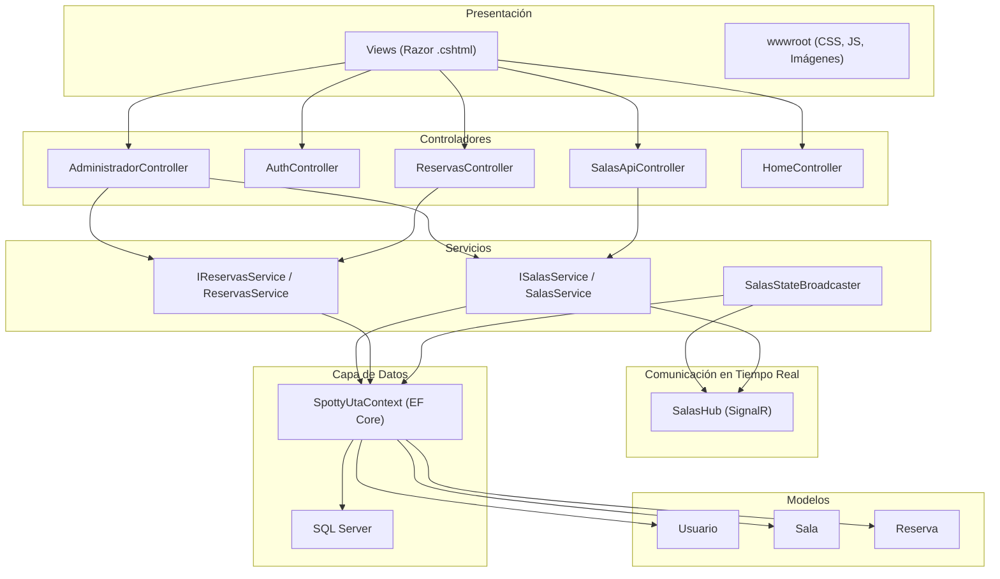
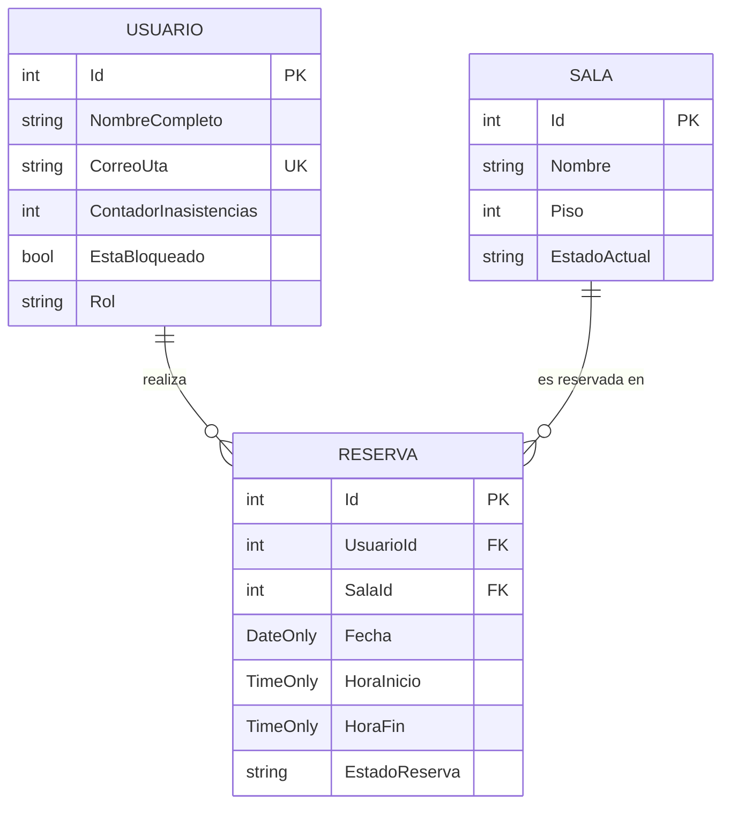
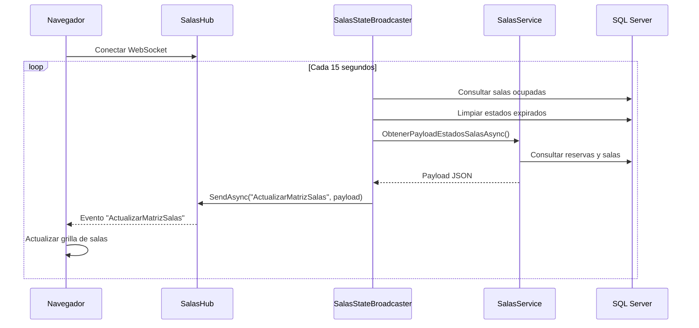
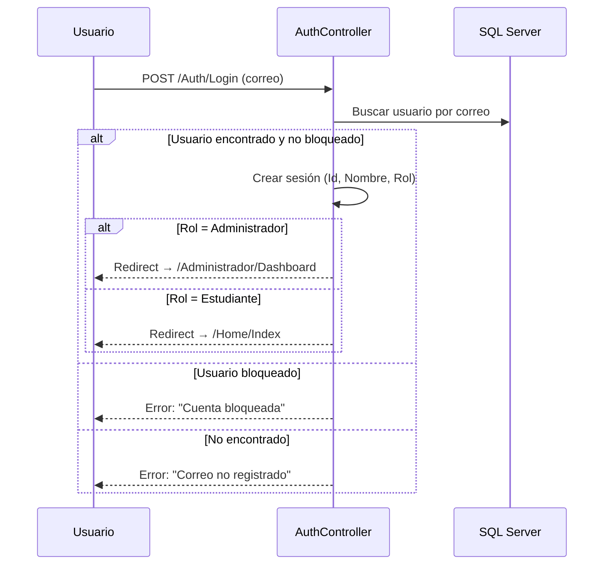

# 📘 Documentación Técnica de Arquitectura - Spotty UTA

> **Sistema de Gestión de Reservas de Boxes de Estudio**
> Universidad de Tarapacá — Biblioteca Central
> Versión 1.0 | Julio 2026

---

## 1. Descripción General del Sistema

**Spotty UTA** es una aplicación web desarrollada en **ASP.NET Core (.NET 10)** que permite a los estudiantes de la Universidad de Tarapacá reservar boxes de estudio en la biblioteca central, y a los administradores gestionar dichas reservas en tiempo real.

### Tecnologías Principales

| Componente | Tecnología |
|---|---|
| Framework Backend | ASP.NET Core 10 (MVC) |
| ORM | Entity Framework Core |
| Base de Datos | SQL Server |
| Tiempo Real | SignalR (WebSockets) |
| Frontend | Razor Views + Bootstrap 5 + CSS personalizado |
| Autenticación | Sesiones de servidor (Cookie-based) |

---

## 2. Arquitectura de Capas



---

## 3. Modelo de Datos (Entidades)

### 3.1. Usuario

| Propiedad | Tipo | Descripción |
|---|---|---|
| `Id` | `int` | Clave primaria autoincremental |
| `NombreCompleto` | `string` | Nombre completo del estudiante o administrador |
| `CorreoUta` | `string` | Correo institucional UTA (único) |
| `ContadorInasistencias` | `int` | Cantidad de faltas acumuladas |
| `EstaBloqueado` | `bool` | Indica si el usuario está sancionado |
| `Rol` | `string` | "Estudiante" o "Administrador" |
| `Reservas` | `ICollection<Reserva>` | Navegación a reservas del usuario |

### 3.2. Sala

| Propiedad | Tipo | Descripción |
|---|---|---|
| `Id` | `int` | Clave primaria autoincremental |
| `Nombre` | `string` | Nombre del box (ej. "Box 1") |
| `Piso` | `int` | Piso del edificio (1, 2 o 3) |
| `EstadoActual` | `string` | Estado operativo: "D" (Disponible), "R" (Reservada), "O" (Ocupada), "I" (Inactiva) |
| `Reservas` | `ICollection<Reserva>` | Navegación a reservas de la sala |

### 3.3. Reserva

| Propiedad | Tipo | Descripción |
|---|---|---|
| `Id` | `int` | Clave primaria autoincremental |
| `UsuarioId` | `int` | FK → Usuario |
| `SalaId` | `int` | FK → Sala |
| `Fecha` | `DateOnly` | Fecha de la reserva |
| `HoraInicio` | `TimeOnly` | Hora de inicio programada |
| `HoraFin` | `TimeOnly` | Hora de fin programada |
| `EstadoReserva` | `string` | Ciclo de vida: "A" (Activa), "Activa" (Ocupada), "Cancelada", "Completada", "Inasistencia" |

### Diagrama Entidad-Relación



---

## 4. Capa de Servicios

### 4.1. ISalasService / SalasService

Servicio encargado de la lógica de negocio de las salas de estudio.

| Método | Descripción |
|---|---|
| `ObtenerHorarioOperacion(DateTime)` | Calcula el horario de operación de la biblioteca según el día de la semana (L-V: 08:00-21:00, Sáb: 09:00-13:00, Dom: Cerrado). |
| `ObtenerEstadoSala(Sala, List<Reserva>, TimeOnly, LibrarySchedule)` | Evalúa el estado real de una sala considerando reservas activas, tolerancia de 20 minutos y horario operativo. |
| `ObtenerPayloadEstadosSalasAsync()` | Genera el payload JSON con el estado de todas las salas para transmisión vía SignalR. |
| `BroadcastEstadosAsync()` | Envía el payload de estados a todos los clientes conectados mediante SignalR. |

### 4.2. IReservasService / ReservasService

Servicio encargado de la lógica de negocio de las reservas.

| Método | Descripción |
|---|---|
| `CrearReservaAsync(int, int, string, bool)` | Crea una nueva reserva validando: reglamento aceptado, formato de hora, reserva duplicada, horario de operación, solapamiento con reservas existentes, y duración mínima de 30 minutos. |
| `GestionarAccionDashboardAsync(int, string, string?)` | Gestiona acciones administrativas sobre reservas: "ocupar" (confirmar asistencia), "liberar" (cancelar sin sanción), "falta" (marcar inasistencia con posible bloqueo). |
| `RegistrarAsistenciaAsync(int, string, int, string?)` | Registra la asistencia de un estudiante desde el panel de mesón: "Presente", "LiberarTemprano", "Inasistencia". |

### 4.3. SalasStateBroadcaster

Servicio en segundo plano (`BackgroundService`) que cada **15 segundos**:
1. Limpia automáticamente salas con estado "Ocupado" cuya reserva haya expirado.
2. Transmite el estado actualizado de todas las salas vía SignalR.

---

## 5. Controladores

### 5.1. AdministradorController

Controlador principal del panel de administración con las siguientes vistas:

| Acción | Ruta | Descripción |
|---|---|---|
| `Dashboard` | `GET /Administrador/Dashboard` | Dashboard principal con KPIs, reservas activas y actividad reciente |
| `GestionSalas` | `GET /Administrador/GestionSalas` | Gestión de salas con matriz de estados por pisos |
| `ReservasActivas` | `GET /Administrador/ReservasActivas` | Tabla de reservas activas con filtros y vista de ocupación temporal |
| `Usuarios` | `GET /Administrador/Usuarios` | Gestión de usuarios con filtros por rol y estado |
| `BloquearUsuario` | `POST /Administrador/BloquearUsuario` | Bloquea manualmente a un usuario |
| `DesbloquearUsuario` | `POST /Administrador/DesbloquearUsuario` | Desbloquea a un usuario |
| `ResetearInasistencias` | `POST /Administrador/ResetearInasistencias` | Restablece a cero el contador de faltas |

### 5.2. AuthController

| Acción | Ruta | Descripción |
|---|---|---|
| `Login` | `GET /Auth/Login` | Muestra formulario de inicio de sesión |
| `Login` | `POST /Auth/Login` | Valida credenciales y crea sesión |
| `Logout` | `GET /Auth/Logout` | Destruye la sesión y redirige al login |

### 5.3. ReservasController

| Acción | Ruta | Descripción |
|---|---|---|
| `CrearReserva` | `POST /Reservas/CrearReserva` | Crea una nueva reserva de sala |
| `GestionarAccionDashboard` | `POST /Reservas/GestionarAccionDashboard` | Ejecuta acciones administrativas sobre reservas |

### 5.4. SalasApiController

| Acción | Ruta | Descripción |
|---|---|---|
| `Estados` | `GET /api/salas/estados` | API REST que devuelve el estado actual de todas las salas en formato JSON |

### 5.5. HomeController

| Acción | Ruta | Descripción |
|---|---|---|
| `Index` | `GET /` | Página principal para estudiantes con la grilla de salas |
| `Privacy` | `GET /Home/Privacy` | Página de política de privacidad |
| `Error` | `GET /Home/Error` | Página de error genérica |

---

## 6. Comunicación en Tiempo Real (SignalR)

### 6.1. SalasHub

Hub de SignalR que actúa como punto de conexión WebSocket para clientes del navegador.

- **Endpoint:** `/salasHub`
- **Evento emitido:** `ActualizarMatrizSalas` — Enviado a todos los clientes cuando cambia el estado de alguna sala.

### 6.2. Flujo de Actualización



---

## 7. Flujo de Autenticación y Autorización

### 7.1. Mecanismo

El sistema utiliza **sesiones de servidor** (`HttpContext.Session`) con cookies para autenticación:

- `UsuarioId`: ID del usuario autenticado
- `UsuarioNombre`: Nombre completo
- `UsuarioRol`: Rol asignado ("Estudiante" o "Administrador")

### 7.2. Flujo de Login



### 7.3. Protección de Rutas

Cada acción del `AdministradorController` valida manualmente:
```csharp
var rol = HttpContext.Session.GetString("UsuarioRol");
if (rol != "Administrador")
{
    return RedirectToAction("Login", "Auth");
}
```

---

## 8. Reglas de Negocio

### 8.1. Horario de Operación

| Día | Horario | Pisos Habilitados |
|---|---|---|
| Lunes a Viernes | 08:00 - 21:00 | Todos (1°, 2°, 3°) |
| Sábado | 09:00 - 13:00 | Solo 1° Piso |
| Domingo | Cerrado | Ninguno |

### 8.2. Reservas

- **Duración máxima:** 2 horas por bloque
- **Duración mínima:** 30 minutos
- **Límite:** 1 reserva activa por usuario a la vez
- **Tolerancia:** 20 minutos para presentarse antes de liberar la sala

### 8.3. Sanciones

- Cada inasistencia incrementa `ContadorInasistencias` en +1
- Al acumular **3 inasistencias**, el usuario es **bloqueado automáticamente**
- Los administradores pueden bloquear/desbloquear manualmente y resetear contadores

---

## 9. Estructura del Proyecto

```
SpottyUTA/
├── Controllers/
│   ├── AdministradorController.cs    # Panel de administración
│   ├── AuthController.cs             # Autenticación y sesiones
│   ├── DebugController.cs            # Utilidades de desarrollo
│   ├── HomeController.cs             # Vistas del estudiante
│   ├── ReservasController.cs         # Creación y gestión de reservas
│   └── SalasApiController.cs         # API REST de estados
├── Data/
│   └── SpottyUtaContext.cs           # Contexto EF Core
├── Helpers/
│   └── SimulationTime.cs             # Proveedor de fecha/hora
├── Hubs/
│   └── SalasHub.cs                   # Hub de SignalR
├── Models/
│   ├── ErrorViewModel.cs             # Modelo de error
│   ├── Reserva.cs                    # Entidad Reserva
│   ├── Sala.cs                       # Entidad Sala
│   └── Usuario.cs                    # Entidad Usuario
├── Services/
│   ├── IReservasService.cs           # Interfaz de servicio de reservas
│   ├── ISalasService.cs              # Interfaz de servicio de salas
│   ├── ReservasService.cs            # Implementación de reservas
│   ├── SalasService.cs               # Implementación de salas
│   └── SalasStateBroadcaster.cs      # Servicio en segundo plano
├── Views/
│   └── Administrador/
│       ├── Dashboard.cshtml          # Vista principal del admin
│       ├── GestionSalas.cshtml       # Vista de gestión de salas
│       ├── ReservasActivas.cshtml    # Vista de reservas activas
│       ├── Usuarios.cshtml           # Vista de gestión de usuarios
│       ├── _DashboardContent.cshtml  # Partial view del dashboard
│       ├── _GestionSalasContent.cshtml
│       ├── _ReservasActivasContent.cshtml
│       └── _UsuariosContent.cshtml
├── wwwroot/
│   └── css/
│       └── admin-dashboard.css       # Estilos del panel admin
├── Program.cs                        # Punto de entrada de la aplicación
├── appsettings.json                  # Configuración de la aplicación
└── SpottyUTA.csproj                  # Archivo de proyecto
```

---

## 10. Inyección de Dependencias

Configurada en `Program.cs`:

```csharp
// Contexto de base de datos
builder.Services.AddDbContext<SpottyUtaContext>(options =>
    options.UseSqlServer(connectionString));

// Servicios de negocio
builder.Services.AddScoped<ISalasService, SalasService>();
builder.Services.AddScoped<IReservasService, ReservasService>();

// Servicio en segundo plano (broadcasting periódico)
builder.Services.AddHostedService<SalasStateBroadcaster>();

// SignalR para comunicación en tiempo real
builder.Services.AddSignalR();

// Sesiones de servidor
builder.Services.AddDistributedMemoryCache();
builder.Services.AddSession();
```

---

> **Autores:**
> - PabloLopezDev
> - icuevas1014
> - Deleriusprohd
